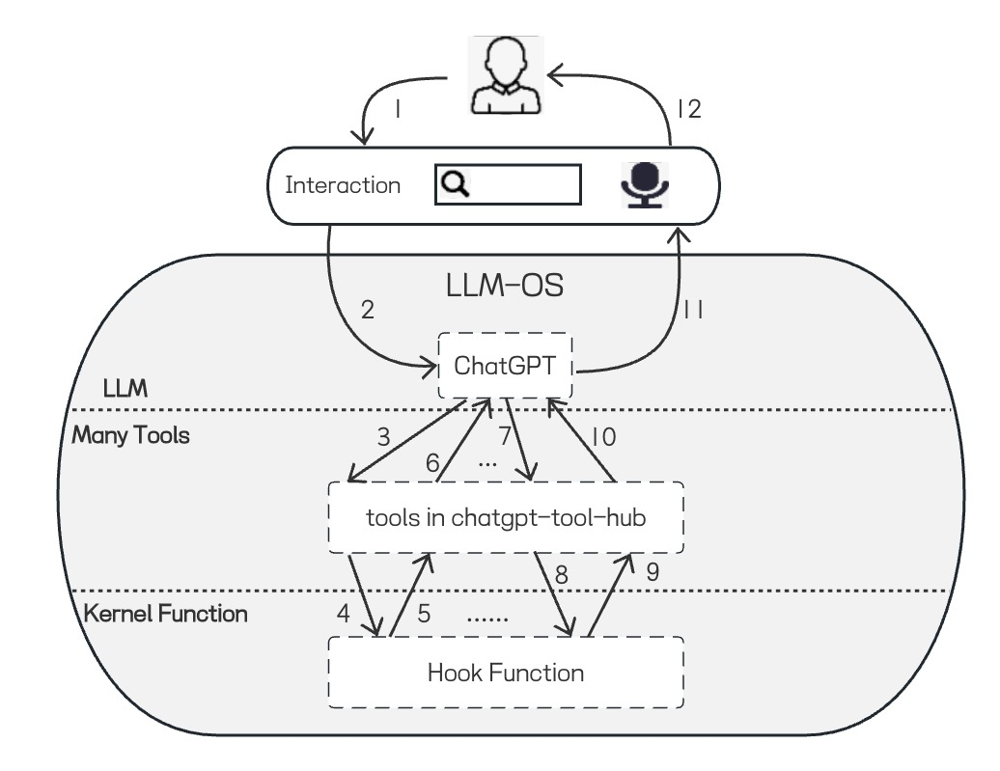

<h2 align='center'> chatgpt-tool-hub / ChatGPT工具引擎 </h2>
<p align='center'>给ChatGPT装上手和脚，拿起工具提高你的生产力</p>

<p align="center">
  <a style="text-decoration:none" href="https://github.com/goldfishh" target="_blank">
    
  </a>
  <a style="text-decoration:none" href="https://github.com/goldfishh" target="_blank">
    
  </a>
  <a style="text-decoration:none" href="https://github.com/goldfishh" target="_blank">
    
  </a>
  <a style="text-decoration:none" href="https://pypi.org/project/chatgpt-tool-hub/" target="_blank">
    
  </a>
</p>

---

简体中文 | [English](./docs/README_en.md)

> 大语言模型涌现能力让人惊艳，ChatGPT出现给NLP技术带来革命，除此之外还让我意识到一种新的人机交互的可能性

## 🌱 4.23 新增LLM-OS demo - [快速上手](#llm-os_jump)


https://user-images.githubusercontent.com/24581028/233855116-ecbc5ea8-246b-46c6-8a1a-67ea6d970077.mp4


#### [更新日志](./docs/update_log.md) | [Q&A](./docs/q_and_a.md)

## 简介

---

这是一个能让ChatGPT使用多个神奇工具的执行引擎，你能用自然语言命令ChatGPT使用联网、搜索、数学运算、控制电脑、执行代码等工具，扩大ChatGPT使用范围提高你的生产力。

本项目因关注到ChatGPT开放插件而诞生，该插件定制性较差，且生态封闭，这不是一个好的趋势，我相信未来国内LLM一定百花齐放，同时我从ChatGPT看到了使用工具的可行性，和潜在价值，因此我希望做一个能兼容未来LLM的工具生态。

如果把ChatGPT的插件比作Apple的App Store，那么这个项目最终形态就是Android OS的开放式生态，简称LLM-OS。在这个生态里所有工具组成一个操作系统，用户仅需输入或传述文字即可做任何事情。  

鉴于目前状况，本项目的定位是：一个开源的ChatGPT工具生态系统，您可以将工具与ChatGPT结合使用，使用自然语言来完成任何事情。

<p align="center">
  
</p>

## 特性

---

#### 1. 可在 LLM-OS demo 单独使用tool-hub
#### 2. tool-hub以插件形式为 [chatgpt-on-wechat](https://github.com/zhayujie/chatgpt-on-wechat) 提供工具能力. 详见 ([tool插件使用教程](https://github.com/goldfishh/chatgpt-on-wechat/tree/master/plugins/tool))
#### 3. 支持中、英文互动
#### 4. 支持上下文记忆
#### 5. 支持proxy
#### 6. 支持大量工具   [工具指南 快速更新中](./docs/tool_tutorial.md) 
#### 7. 支持多种工具同时且自动调用、树状编排工具

### ⛳ 看看tool-hub未来计划更新的特性：[tool-hub todo-list](#plan) 
### 📭 去 [issues](https://github.com/goldfishh/chatgpt-tool-hub/issues) 提提建议 

## ✈️ 快速开始

---

### 1.  LLM-OS demo

<span id="llm-os_jump"></span>

#### (1). 克隆仓库

```bash
git clone https://github.com/goldfishh/chatgpt-tool-hub.git
cd chatgpt-tool-hub
```

#### (2). 使用pip安装本项目依赖

```bash
pip3 install -r requirements.txt
```

#### (3). 重命名.env.template 和 config.json.template文件，去掉.template后缀 打开文件填入配置参数 

`.env` 用于配置全局参数 文件配置示例
```text
OPENAI_API_KEY=sk-xx          // 必填，你的OPENAI API Key, 如何申请请见Q&A
MODEL_NAME=gpt-3.5-turbo      // 选填，OPENAI LLM模型
THINK_DEPTH=3                 // 选填，默认为3，控制LLM-OS的最大调用工具次数，过大不一定能提高回复质量
REQUEST_TIMEOUT=90            // 选填，默认120，等待openai api回复的最大时间
PROXY=http://192.168.7.1:7890 // 选填，当你需要代理访问openai时可填
DEBUG=false                   // 选填，debug模式
```

`config.json` 用于配置工具参数 文件配置示例
```json
{
  "tools": [],   // 填入你想用到的额外工具名
  "kwargs": {
      "no_default": false,   // 是否不使用默认工具, 默认使用python, terminal, url-get, meteo-weather
      "top_k_results": 2,  // 控制部分搜索工具(如arxiv、wikipedia)返回只前k条记录, 不建议过多
      // 需要额外申请api-key的工具，在这里填入
  }
}
```

需要额外申请工具config.json配置示例见：[工具申请方法与配置说明](./docs/apply_optional_tool.md)

#### (4). 执行terminal_io.py

```bash
python3 terminal_io.py
```

#### (5). 进入LLM-OS后你可以自行探索 或者进一步浏览详细教程：[LLM_OS demo使用说明](https://github.com/goldfishh/llm-os/blob/main/README.md)

--- 

### 2. 我给[chatgpt-on-wechat](https://github.com/zhayujie/chatgpt-on-wechat)开发了tool插件

> 使用本方法，你将可以用微信作为前端更方便地使用tool-hub

#### 查阅chatgpt-on-wechat文档中的[项目简介](https://github.com/zhayujie/chatgpt-on-wechat#%E7%AE%80%E4%BB%8B) 和 [快速开始](https://github.com/zhayujie/chatgpt-on-wechat#%E5%BF%AB%E9%80%9F%E5%BC%80%E5%A7%8B)

#### Note: 你需要安装拓展依赖才能使用tool插件

#### [tool插件教程](https://github.com/goldfishh/chatgpt-on-wechat/blob/master/plugins/tool/README.md)

---

### 3. 你是其他项目开发者，想要接入本工具引擎

> 本项目已发布到PyPI上，你只需使用pip命令即可安装

#### (1). 安装chatgpt-tool-hub包

```bash
pip install -i https://pypi.python.org/simple chatgpt-tool-hub
```

#### (2). 快速开始

```python
import os
from chatgpt_tool_hub.apps import AppFactory
os.environ["OPENAI_API_KEY"] = "YOUR_OPENAI_API_KEY"  # 必填
os.environ["PROXY"] = "YOUR_PROXY_ADDRESS"            # 选填
app = AppFactory().create_app(tools_list=[], **{})
reply = app.ask("YOUR_QUESTION_TO_HERE")
print(reply)
```

#### (3). 以插件形式接入tool-hub可参考tool插件实现

[tool.py](https://github.com/goldfishh/chatgpt-on-wechat/blob/master/plugins/tool/tool.py)

> 如果有需求，我会更新更详细接入的文档，欢迎提issue

---

## ☕ 宣传

#### 如果你想支持本项目，欢迎给项目点个star、提issue和pr
#### 如果你想进一步支持项目作者少掉头发，努力开发，可以给和我一起开发项目的伙伴 或 单独给我来杯 ☕

<table><tr>
<td><a href="https://public.zsxq.com/groups/88885848842852.html"></a></td>
<td></td>
</tr></table> 

---

## 工具指南 

### 🚀 [工具指南 工具快速开发中](./docs/tool_tutorial.md)

---

## 原理

---

工具引擎的实现原理本质是**Chain-of-Thought**：[Chain-of-Thought Prompting Elicits Reasoning in Large Language Models](https://arxiv.org/abs/2201.11903)
  
我将通过用6个自问自答的问题解释chatgpt-tool-hub的工作原理  

#### 1. 事务型工具（如terminal、python）是在哪运行，以及如何执行的

事务型工具是在你本地运行的，事务型工具本质是一个python编写的函数，terminal、python、url-get工具分别用到了封装调用subprocess库、python解释器和requests库的函数

--- 

#### 2. ChatGPT是如何触发调用这些函数

借助ChatGPT api提供的temperature参数，该参数越低，ChatGPT输出的结果会更集中和确定，当temperature为0时，相同的问题会得到统一回答  
我在prompt构建时会提供给ChatGPT此时用到的工具列表信息，每个工具信息包含：工具名 和 工具描述：

```text
TOOLS:  
------  
  
You have access to the following tools:  

> Python REPL: A Python shell. Use this to execute python commands. 
> url-get: A portal to the internet. Use this when you need to get specific content from a website. 
> Terminal: Executes commands in a terminal. 
> Bing Search: A wrapper around Bing Search. Useful for when you need to answer questions about current events. 
```

有了工具prompt，这时ChatGPT就能理解这些工具名字和使用场景，调用事务函数还需要进一步细化我和ChatGPT之间的通信协议（仍是通过prompt）：
通信协议限制ChatGPT使用工具时返回内容的格式，只能返回三种前缀的内容：

```text
1. Thought: Do I need to use a tool? Yes or No
2. Action: 工具名字
3. Action Input: 工具的输入
```

通信协议完整prompt：  
```text
To use a tool, please use the following format:


Thought: Do I need to use a tool? Yes
Action: the action to take, should be one of [Python REPL, url-get, Terminal, Bing Search]
Action Input: the input to the action
Observation: the result of the action
```

此时，工具引擎有专用的文本解析模块负责解析这些内容，当解析成功后，将调度到具体事务函数执行，然后返回固定前缀的结果：

```text
Observation: 当事务函数执行完成返回时的内容
```

带Observation前缀的内容往往是使用事务型工具的用户想知道的答案

--- 
  
#### 3. ChatGPT怎么知道该用的工具和输入，是否每次都严格按照prompt生成格式化内容

ChatGPT微调时进行大量Q&A、CoT预料的学习和RLHF调优，目前ChatGPT对于工具和内容生成的质量是有保证的  
但是目前不是100%，因为会有低质量prompt或者不合适工具的输入，这些问题在工具引擎会进行鲁棒性的处理来保证生成内容的稳定性  

我创建一个issue，可以方便大家来获取和分享使用tool过程解决的有趣问题和思路、每个tool使用时prompt技巧、遇到问题的处理办法：
[更好的使用tool的技巧交流](https://github.com/goldfishh/chatgpt-tool-hub/issues/3)

--- 

#### 4. 如果需要多个工具交替配合解决某个问题，引擎是怎么做的？

当事务函数处理完成返回结果后，默认不会直接返回给用户，而是根据结果内容CoT，在整个prompt中，还有两个子prompt负责用户对话历史记录和中间结果

用户对话历史记录：
```text
Human: A question
AI: A answer
......
```

中间结果：
```text
Thought: Do I need to use a tool? Yes
Action: Wolfram Alpha
Action Input: gdp china vs. usa
Observation: China\nUnited States | GDP | nominal \nAnswer: China | $14.72 trillion per year\nUnited States | $20.95 trillion per year\n(2020 estimates)
Thought:
```

每轮工具CoT过程均会作为下次推理判断工具的依据，由此迭代地进行工具判断、执行，最后当识别到特定前缀时，CoT结果将返回给用户    
  
CoT结束prompt：
```text
When you have a response to say to the Human, or if you do not need to use a tool, you MUST use the format:

Thought: Do I need to use a tool? No
AI: the response to the original input question in chinese

```


ChatGPT使用工具过程并不顺利：当遇到迭代次数到达预设值时，会根据历史过程，返回给用户最后结果    

--- 

#### 5. 事务性工具交给ChatGPT是否具有不可预料的危险性？

是的，当你用事务性工具时，你就给予了ChatGPT在你本地运行程序的权利，你需要权限限制来规避可能的风险      
如果无法信任ChatGPT主导你的机器，请不要使用  

--- 

#### 6. 非事务型工具的实现原理是什么

参考[ChatGPT 官方插件](https://github.com/openai/chatgpt-retrieval-plugin)，非事务性工具也称为插件型工具，该工具可视为开放性的ChatGPT插件

---


## 🎯 计划

<span id="plan"></span>

---
 
### feature todolist
  
[✓] 结果可解释性输出 -> LLM-OS的内心独白  
[✓] 一个前端demo  -> LLM-OS  
[✓] 长文本场景 -> summary工具  
[✓] 长工具顺序控制 -> 实现了toolintool机制    
[✓] 粒度配置 -> 每个tool封装的LLM可独立配置  
[○] tokens计算，精确管理    
[○] gpt_index长文本(pdf、html)检索   
[○] 接口并发支持  
[○] 接入国内LLM  
[○] 兼容不使用tool的场景  
[○] 互斥tool控制  
[○] subtree 动态注册&反注册  
[○] 工具中断  
[○] 定时调度  
[○] 语音输入、输出  
  
### tool todolist  
   
[○] stable-diffusion 中文prompt翻译    
[✓] ImageCaptioning    
[○] 小米智能家居控制    
[○] 支持ChatGPT官方插件  
[○] 让LLM来实现tool  
[○] 支持图片处理工具    
[○] 支持视频处理工具   
[✗] Wechat  

## 工具开发指南

---
 
目前工具分为两类：事务型工具、插件型工具   
 
我等待有需求之后更新这部分内容    

[工具开发教程](./docs/tool_development_guide.md)

## 背景

我将很快更新这部分内容   

---

## 感谢

感谢以下项目对本项目提供的有力支持：

#### 1. [langchain](https://github.com/hwchase17/langchain)

#### 2. [Auto-GPT](https://github.com/Significant-Gravitas/Auto-GPT)

#### 3. [chatgpt-in-terminal](https://github.com/xiaoxx970/chatgpt-in-terminal)

---
