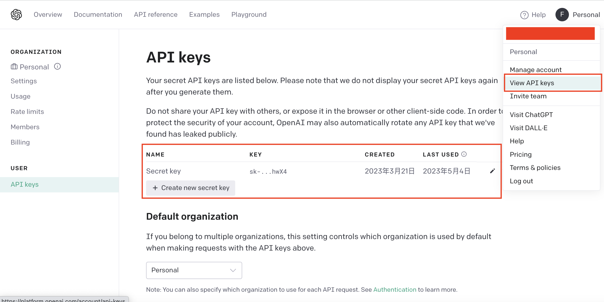

<h2 align='center'> chatgpt-tool-hub / ChatGPT工具引擎 </h2>
<p align='center'>给ChatGPT装上手和脚，拿起工具提高你的生产力</p>

<p align="center">
  <a style="text-decoration:none" href="https://github.com/goldfishh" target="_blank">
    
  </a>
  <a style="text-decoration:none" href="https://github.com/goldfishh" target="_blank">
    
  </a>
  <a style="text-decoration:none" href="https://github.com/goldfishh" target="_blank">
    
  </a>
  <a style="text-decoration:none" href="https://pypi.org/project/chatgpt-tool-hub/" target="_blank">
    
  </a>
</p>

---

### 1. 项目前置条件

#### (1). 获取llm api-key，目前有三种方式

##### [1]. openai

你需要注册一个 [OpenAI 帐户](https://platform.openai.com/) 并获取 API 密钥。

OpenAI api-key可以在点击首页右上角“View API keys”打开的页面生成



##### [2]. azure

在.env 或 config.json 中设置 `llm_api_base_url`

```bash
# .env
LLM_API_BASE_URL=https://xxx.openai.azure.com/
```

```json
// config.json
{
  "tools": [
    // ...
  ],
  "kwargs": {
    // ...
    "llm_api_base_url": "https://xxx.openai.azure.com/",
    // ...
  }
}
```

##### [3]. api转发服务(不推荐，请仔细甄别服务提供商)

以 [openai-sb](https://openai-sb.com/api/openai-sb/) 为例：

设置 `llm_api_base_url` 和 `llm_api_key`

例子：
```json
{
  "tools": [
    // ...
  ],
  "kwargs": {
    // ...
    "llm_api_base_url": "https://api.openai-sb.com/v1",
    "llm_api_key": "sb-2f19...sample_key"
    // ...
  }
}
```


#### (2). 安装python 3.8+

--- 

### 2. 遇到问题求助前，你需要用test.py工具尝试复现你的问题

#### (1). 克隆源代码

```bash
git clone git@github.com:goldfishh/chatgpt-tool-hub.git
```

#### (2). `pip install -r requirements.txt`

#### (3). 重命名`config.json.template`为`config.json`，编辑`config.json`填入你的`llm_api_key`

```json
{
  "tools": [],  // 这里填入你想加载的工具名，默认工具无需填入自动加载
  "kwargs": {
      "llm_api_key": "",  // 必填
      "proxy": "",  // 代理配置，国外ip可忽略
      "debug": false,  // 当你遇到问题提issue前请设置debug为true，提交输出日志
      "no_default": false,  // 控制是否加载默认工具
      "model_name": "gpt-3.5-turbo"  // 默认，其他模型暂未测试
  }
}
```

#### (4). `python3 test.py 你的问题1 [你的问题2 ......]`

#### (5). 如果问题仍出现请提issue，贴上日志

--- 

